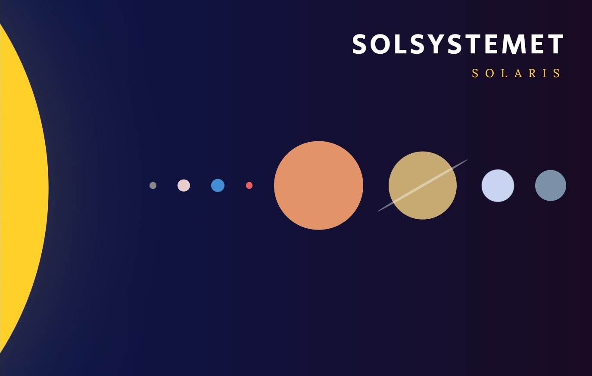
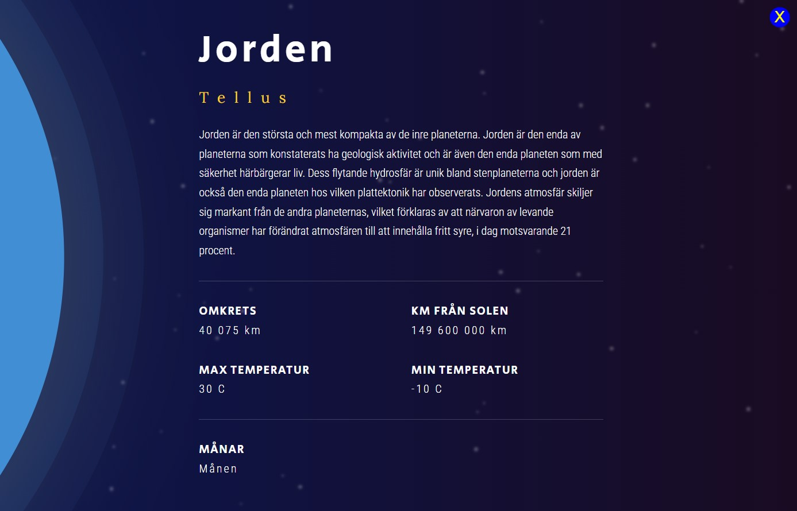

# Project Solaris

<--- Paulius Kamuntavicius HVE js course learnig project --->

Explore our solar system and learn facts about each planet body.

## Table of Contents

- [Project Name](#project-solaris)
- [Clone the Repository](#clone-the-repository)
- [Screenshots](#screenshots)

## Clone the repository
git clone https://github.com/ELSOLRA/Solaris.git

## Screenshots

### Screenshot 1

### Screenshot 2
